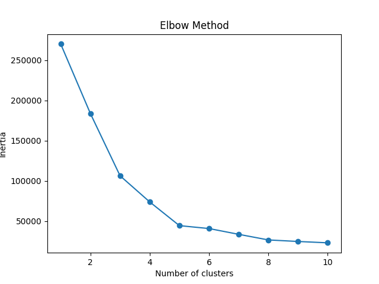
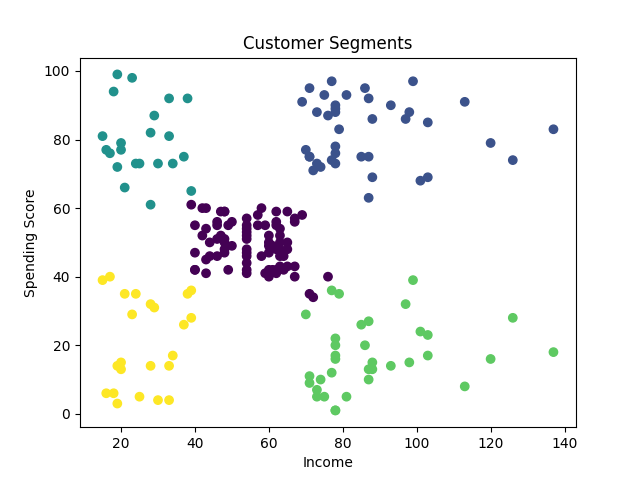

# 📊 Customer Segmentation using K-Means

## 🎯 Objective
Group customers into segments based on income and spending behavior using Machine Learning.

---

## 🧠 Method
- Data preprocessing
- Feature selection
- Elbow method
- K-Means clustering

---

## 📈 Results
Customers were grouped into meaningful segments:
- High income / high spending
- High income / low spending
- Low income / high spending
- Low income / low spending

---

## 📊 Visual Results

### Elbow Method

### Customer Clusters

---

## 💡 Business Value
Helps companies understand customer behavior and improve targeted marketing strategies.

---

## 🛠 Tools
Python, Pandas, Scikit-learn, Matplotlib
